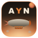

<!-- markdownlint-disable MD013 MD034 -->
# meiCloud — All You Need

A private ATM10-derivative modpack for Minecraft 1.21.1 on NeoForge.

**Status:** v0.1.2 — friends-only. Not seeking general distribution.

## What this is

[All The Mods 10](https://www.curseforge.com/minecraft/modpacks/all-the-mods-10) (v7.0) plus 32 hand-picked additions and 137 mod bumps. The headline is the **aerospace + space chain**:

- Build airships with [Create: Aeronautics](https://modrinth.com/mod/create-aeronautics)
- Mount artillery on them with [Create: Big Cannons](https://www.curseforge.com/minecraft/mc-mods/create-big-cannons)
- Run trains across the world with [Create: Steam'n'Rails](https://modrinth.com/mod/create-steam-n-rails-1.21.1)
- Build rockets and reach orbit with [Creating Space](https://modrinth.com/mod/creating-space)
- Refine oil for diesel-powered generators
- Cross-mod integrations between Mekanism, Create, IE, and AE2

## Install

You need:

1. **[Prism Launcher](https://prismlauncher.org/)** (FOSS, GPLv3)
2. The latest `.mrpack` from [Releases](https://github.com/christopher-john-czettel/meicloud-all-you-need/releases)
3. A copy of Minecraft (purchased + a Microsoft account)

Steps:

1. Install Prism Launcher
2. "Add Instance" → "Import" → paste the GitHub release URL of the `.mrpack`
3. Press "Play"

To update later, right-click the instance → "Edit" → "Version" → "Update Pack" → paste the newest `.mrpack` URL.

## Where the wiki lives

Per-mod documentation lives on the private wiki at https://atm10.meicloud.net/wiki/. The pack is deployed against that server.

## House rules (server-side)

- **PvP off** — sword swings on other players do nothing.
- **Mob griefing off** — no creeper craters near builds.
- **Hardcore-ish**: `keepInventory` is off, you lose your stuff on death.
- **8 max players** — friends only, whitelist enforced.

## Built with

- [packwiz](https://packwiz.infra.link/) for the build
- [Prism Launcher](https://prismlauncher.org/) for the launch
- Mods sourced from [CurseForge](https://www.curseforge.com/) and [Modrinth](https://modrinth.com/)

## License

[MIT](LICENSE) for the pack source (the `pack/` directory, README, KubeJS scripts, branding). Each referenced mod keeps its own license.

## Credits

- The **[All The Mods team](https://github.com/AllTheMods)** for the ATM10 base
- Every mod author — there are 509 of them.
