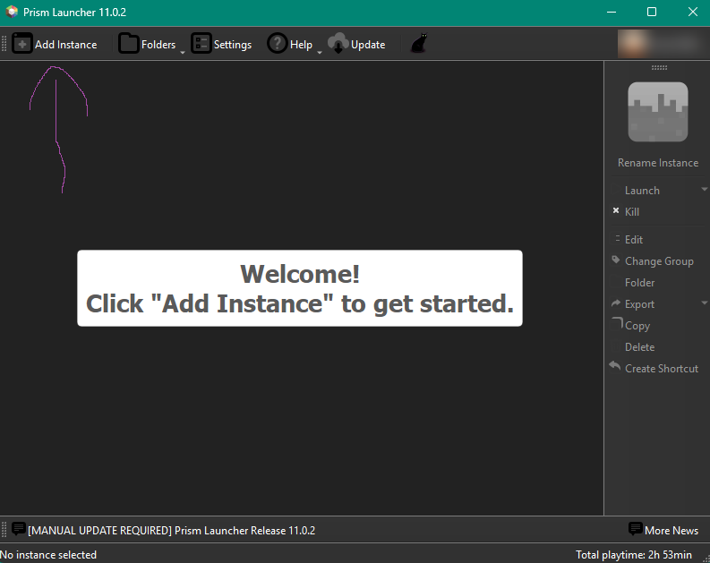
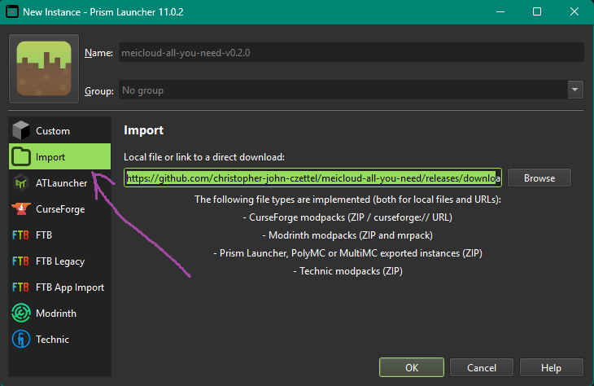
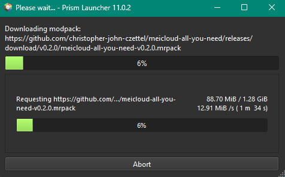
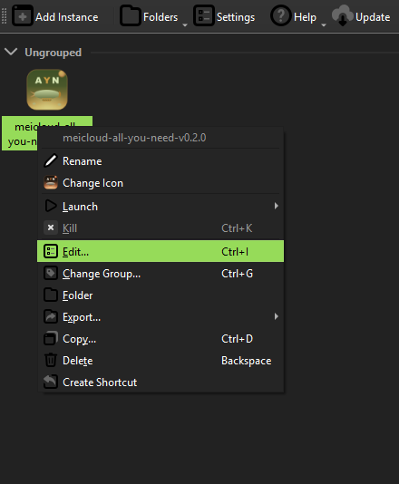
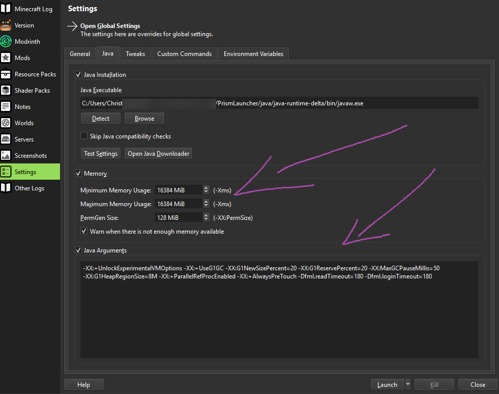

<!-- markdownlint-disable MD013 MD024 MD032 MD022 MD036 MD060 -->
# Installation guide — meiCloud — All You Need

This walks you through installing the pack on a Windows 11 desktop with Prism Launcher. Steps are functionally the same on macOS / Linux Prism — only the screenshots will look slightly different.

You need three things up front:

1. **Prism Launcher** — https://prismlauncher.org/ (FOSS, GPLv3)
2. **A Microsoft account with Minecraft Java Edition** purchased — sign in via Prism's account manager first
3. **~25 GB of free disk space** — the unpacked instance is ~6 GB; you also want headroom for world saves, Distant Horizons LOD databases, and SimpleBackups archives

The mrpack itself is **~1.37 GB**. The download is the slow part; the actual install is a few minutes.

---

## Step 1 — Open Prism, click **"Add Instance"**

After installing Prism and signing in with your Microsoft account, you'll see the empty instance list. Click **Add Instance** in the top-left toolbar.



---

## Step 2 — Import from URL

In the dialog, switch to the **Import** tab on the left. In the "Local file or link to a direct download" field, paste:

```text
https://github.com/christopher-john-czettel/meicloud-all-you-need/releases/download/v0.2.2/meicloud-all-you-need-v0.2.2.mrpack
```

For future releases, replace `v0.2.2` with whatever the latest tag is at https://github.com/christopher-john-czettel/meicloud-all-you-need/releases.

You can rename the instance in the **Name** field (defaults to the mrpack filename without extension). Click **OK**.



---

## Step 3 — Wait for the download

Prism fetches the mrpack (~1.37 GB), unpacks it, and resolves all packwiz-tracked mods from Modrinth + CurseForge + our self-hosted GitHub raw assets. Expect 5-15 minutes on a typical home connection.



The download fetches:

- **464 mods** from Modrinth and CurseForge
- **2 self-hosted patched jars** from `raw.githubusercontent.com/christopher-john-czettel/meicloud-all-you-need/main/pack/local-jars/`:
  - `allthetweaks-1.21.1-2.9.4-meicloud-patched.jar` — has the ATM10 branding mixins surgically removed
  - `creatingspace-1.21.1-1.7.18-meicloud-patched.jar` — has the `WindowResizeMixin` removed (fixes a NeoForge 21.1.234 load-order crash)
- **Pack overrides** — KubeJS scripts, configs, shaderpack, FancyMenu assets, `servers.dat`, datapack stubs

If any download fails (rare; usually a CurseForge rate-limit transient), close and re-open the instance via the right-click menu → **Refresh** — Prism resumes from where it left off.

---

## Step 4 — Edit the new instance

The instance shows up in your instance list with the **meiCloud — All You Need** icon. **Right-click it** and pick **Edit…** (Ctrl+I works too).



**Don't launch yet.** The mrpack ships configs, mods, shaders, and the server-list entry — but **JVM settings and heap size are per-Prism-install** and have to be applied manually. Launching with default Prism Java settings will boot but will be slow + GC-stuttery.

---

## Step 5 — Configure Memory and JVM Arguments

In the Edit Instance window, pick **Settings** in the left sidebar, then the **Java** tab at the top.



Apply these exact values:

### Memory section

| Field | Value |
|---|---|
| ☑ **Memory** | ✅ enabled |
| Minimum Memory Usage | **16384** MiB |
| Maximum Memory Usage | **16384** MiB |
| PermGen Size | 128 MiB (default — harmless legacy field, ignored on Java 21) |
| ☑ Warn when there is not enough memory available | ✅ enabled (default) |

**Why 16 GB Min = Max:** With `-XX:+AlwaysPreTouch` in the JVM args (below), the JVM commits the full heap to physical RAM at startup. Setting `-Xms = -Xmx` skips the runtime heap-resize logic entirely. 16 GB is the sweet spot for G1's `G1HeapRegionSize=8M` (2-32 GB optimal range); past 16 GB G1's young-gen scan time grows into perceptible pauses.

If your machine has only 16 GB total system RAM, drop both to **10240** (10 GB) — the pack will still run, you'll just have less headroom for SimpleBackups + JEI/EMI index bursts.

### Java Arguments section

| Field | Value |
|---|---|
| ☑ **Java Arguments** | ✅ enabled |

Paste this single line into the arguments box (one line, no newlines):

```text
-XX:+UnlockExperimentalVMOptions -XX:+UseG1GC -XX:G1NewSizePercent=20 -XX:G1ReservePercent=20 -XX:MaxGCPauseMillis=50 -XX:G1HeapRegionSize=8M -XX:+ParallelRefProcEnabled -XX:+AlwaysPreTouch -Dfml.readTimeout=180 -Dfml.loginTimeout=180
```

### What each flag does

| Flag | Purpose |
|---|---|
| `-XX:+UnlockExperimentalVMOptions` | Required to use the `G1*` tuning flags below |
| `-XX:+UseG1GC` | G1 garbage collector. **Don't switch to ZGC** — we tried, it OOM'd on this exact workload. |
| `-XX:G1NewSizePercent=20` | Young generation = 20 % of heap (3.2 GB at 16 GB heap). Right-sized for high-allocation modded MC. |
| `-XX:G1ReservePercent=20` | Reserve 20 % of heap as buffer; prevents promotion failures during allocation spikes (SimpleBackups, EMI index build). |
| `-XX:MaxGCPauseMillis=50` | Target max GC pause = 50 ms. If you see microstuttering, drop to **30** — costs ~2-3 % avg FPS for tighter 1 %-lows. |
| `-XX:G1HeapRegionSize=8M` | 8 MB regions. Optimal for heap sizes 2-32 GB. |
| `-XX:+ParallelRefProcEnabled` | Parallelize reference processing across CPU cores. Free win on 8+ core CPUs. |
| `-XX:+AlwaysPreTouch` | Commits full heap to physical RAM at startup. Prevents first-explore stutter from heap growth. **This is why Min and Max are matched** — if Min < Max, AlwaysPreTouch only commits Min and the rest grows lazily. |
| `-Dfml.readTimeout=180` | Mod-loading read timeout = 3 minutes. Vanilla default is 90 s; we need more because 564 mods. |
| `-Dfml.loginTimeout=180` | Server-handshake timeout = 3 minutes. Same reasoning. |

### Java Executable

Should auto-detect a Java 21 install. If it doesn't, click **Open Java Downloader** in Prism, pick **Adoptium / Microsoft / Azul OpenJDK 21**, and re-run **Detect**. NeoForge 1.21.1 requires Java 21 — Java 17 will silently mis-load mixin classes and crash.

If you have multiple Java installs and Prism auto-picks the wrong one, hit **Browse** and point it at `javaw.exe` from a Java 21 install. Microsoft OpenJDK 21 is what most modded MC players use; the path looks like:

```text
C:\Users\<you>\AppData\Roaming\PrismLauncher\java\java-runtime-delta\bin\javaw.exe
```

---

## Step 6 — First launch

Close the Edit window. Back in the main Prism view, **double-click** the instance (or hit the **Launch** button on the right sidebar) to start it.

Expect on first launch:

- **Boot to main menu**: ~140–160 s (mod loading is the bulk — unavoidable with 564 mods)
- **Main menu**: meiCloud splash background, "meiCloud — All You Need" window title
- **Server list (Multiplayer menu)**: pre-populated with `meiCloud — All You Need` → `ayn.meicloud.net:55565`
- **Single player → Create world → Click play**: ~60–80 s of "Loading Terrain" (datapack reload + DH dim startup + EMI building its index in the background)
- **In-world**: BSL+Clrwl shader active (already selected as default in `iris.properties`)

If anything crashes on first launch, check `logs/latest.log` and `crash-reports/` — and ping @chris with the crash file.

---

## Performance tuning (optional)

For tightening 1 %-lows, AMD Adrenalin / NVIDIA Control Panel per-app profiles, Windows 11 HAGS / Game Mode tweaks, etc., see **[docs/PERFORMANCE.md](PERFORMANCE.md)**.

The defaults are tuned to "playable on Ryzen 5 5600 + RX 6600" hardware. If you have something beefier, the perf doc covers headroom you can claim.

---

## Updating to a newer release

When a new tag goes up at https://github.com/christopher-john-czettel/meicloud-all-you-need/releases:

1. Right-click the instance → **Edit → Version** (left sidebar)
2. Click **Modify Pack** at the top right
3. Paste the new release's `.mrpack` URL
4. Confirm
5. Prism re-downloads what changed and preserves your `saves/`, `screenshots/`, `journeymap/` data
6. Your Java settings from Step 5 are preserved — they're at the instance level, not the pack level

Re-applying the Java settings is only needed if you ever delete and re-import the instance.

---

## Troubleshooting

### "Cannot get config value before config is loaded" on boot

If you see this in `crash-reports/`, you're on **v0.2.0** or older — the bug was a `creatingspace` mixin firing before its config was registered. Fixed in v0.2.1 by patching the mod jar. Update to the latest release.

### Mods download fails / timeout

CurseForge sometimes throttles non-API-key downloads. Re-open the instance via right-click → **Refresh**. Or wait 5 minutes and re-try.

### Shader looks washed out / dim main menu

The BSL+Clrwl shader is tonemapping the FancyMenu splash background — known cosmetic quirk, doesn't affect gameplay. Workaround: press **K** on the title screen to toggle Iris shaders off (re-enables automatically on world join).

### "Java Heap Space" OOM in chat or logs

You're below 16 GB heap, or you have **ZGC** in your JVM args (paste the exact G1 args block from Step 5). G1 is the correct GC for this pack on 12-16 GB heaps. ZGC needs ~30-40 % more headroom and OOMs on workloads this dense.

### `[KubeJS errors found N]` chat line

If `N > 0` on first launch, something in `kubejs/data/` or a server script failed. Report the count + the linked `erroring_recipes.md` content; we'll patch the next release.

### Pack works but FPS feels low

Open the F3 debug overlay. Read off:
- GPU usage % (top-right block)
- Heap usage (top-right "Mem:")
- Server tick time (top-left)

If GPU < 50 % and FPS is low, you're CPU-bound — see the perf guide (Tier A, especially HAGS off).
If heap usage > 90 %, bump heap or check for a mod memory leak via `[AllTheLeaks]` lines.
If server tick > 50 ms consistently, something's pegging the integrated server — try `/spark profiler --timeout 60` and read the link it spits out.

---

## Where things live in the instance

For poking around without breaking anything:

```text
<instance>/minecraft/
├── mods/                              # all the mods
├── config/                            # mod-side configs
│   ├── iris.properties                # shader selection
│   ├── DistantHorizons.toml          # DH tuning
│   ├── simplebackups-common.toml     # backup schedule
│   └── ...
├── shaderpacks/
│   ├── BSL_v10.1.1 + Clrwl_1.0.5.zip
│   └── BSL_v10.1.1 + Clrwl_1.0.5.zip.txt   # our LOW-profile settings
├── kubejs/                            # KubeJS server/client/startup scripts + datapack stubs
├── saves/                             # your worlds
├── simplebackups/                     # backup archive output (you can delete old ones)
├── servers.dat                        # the server list — pre-populated with AYN
└── options.txt                        # your video settings (FPS cap, render dist, etc.)
```

Anything in `config/` regenerates if you delete the file — useful if you ever break a config and want defaults back.
